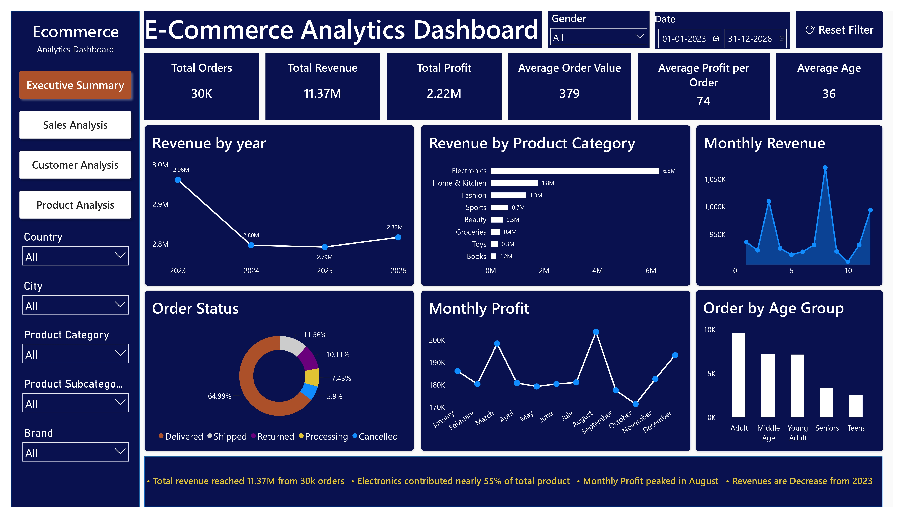
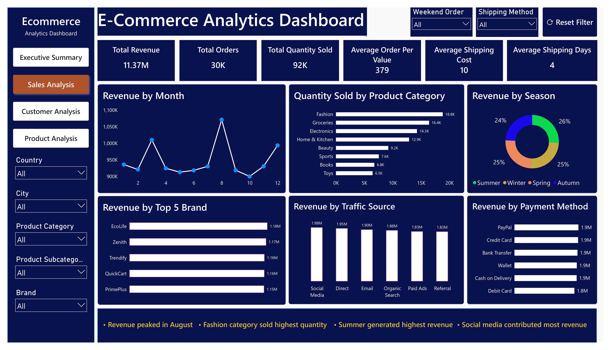
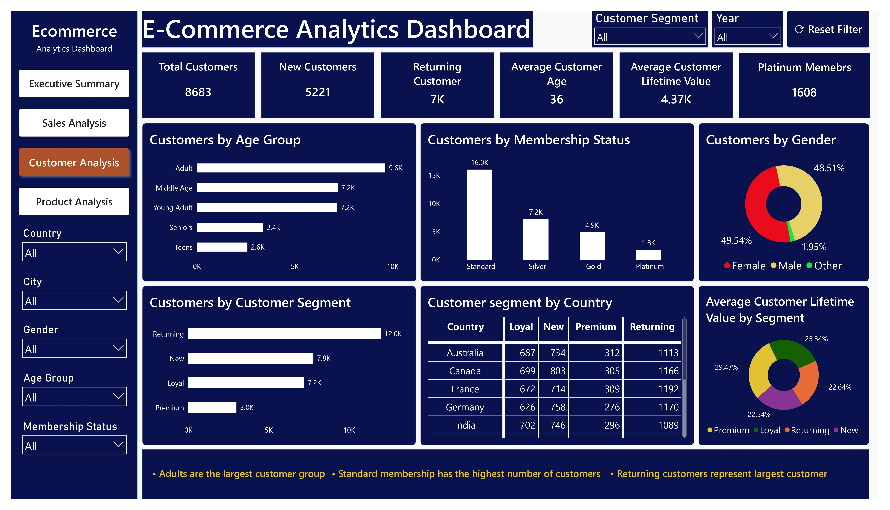
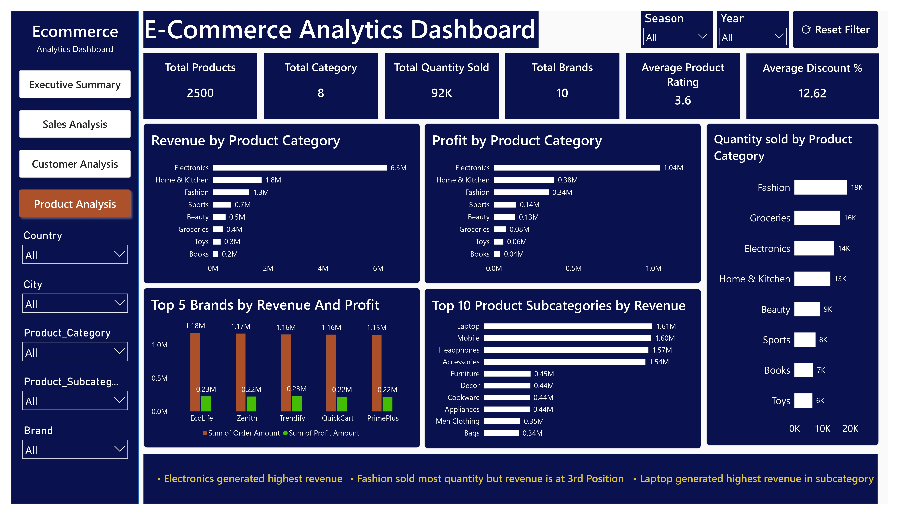

# 📊 E-Commerce Sales Analytics | End-to-End Data Analyst Project

## 📌 Project Overview

This project is an end-to-end **E-Commerce Sales Analytics** solution developed using **SQL, Python, and Power BI**. The project demonstrates the complete data analytics lifecycle, starting from raw data import and SQL-based analysis to Python data cleaning, exploratory data analysis (EDA), and interactive dashboard development in Power BI.

The objective is to analyze sales performance, customer behavior, and product performance to generate actionable business insights that support data-driven decision-making.

---

# 🎯 Business Objectives

This project aims to answer the following business questions:

- How much revenue and profit does the business generate?
- Which products, brands, and categories perform the best?
- How do sales change over time?
- Which customer segments contribute the most revenue?
- Which payment methods and traffic sources generate the highest sales?
- How do customer membership levels affect purchasing behavior?

---

# 🛠️ Tools & Technologies

| Tool | Purpose |
|------|----------|
| Excel | Initial Data Inspection |
| MySQL | Data Cleaning & Business Analysis |
| Python (Pandas) | Data Cleaning & Feature Engineering |
| Matplotlib | Exploratory Data Analysis |
| Seaborn | Statistical Visualization |
| Power BI | Interactive Dashboard & Reporting |

---

# 📂 Dataset Information

The dataset contains approximately **30,000 e-commerce transactions**.

### Dataset includes

- Customer Information
- Product Information
- Sales Transactions
- Shipping Details
- Payment Information
- Membership Details
- Marketing Channels

### Important Columns

- Order_ID
- Customer_ID
- Order_Date
- Customer_Age
- Customer_Gender
- Country
- City
- Customer_Segment
- Membership_Status
- Product_Category
- Product_Subcategory
- Brand
- Quantity
- Order_Amount
- Profit_Amount
- Discount_Percentage
- Shipping_Cost
- Payment_Method
- Traffic_Source
- Season
- Order_Status

---

# 🚀 Project Workflow

```
Raw Excel Dataset
        │
        ▼
Data Validation (Excel)
        │
        ▼
SQL Data Cleaning & Business Analysis
        │
        ▼
Python Data Cleaning & Feature Engineering
        │
        ▼
Exploratory Data Analysis (EDA)
        │
        ▼
Power BI Dashboard
        │
        ▼
Business Insights
```

---

# 🗄️ SQL Data Analysis

The raw dataset was first imported into **MySQL**, where data validation, cleaning, and business analysis were performed.

## SQL Tasks Performed

### Data Validation

- Imported raw dataset into MySQL
- Verified data types
- Converted Order_Date to DATE format
- Checked duplicate records
- Validated NULL values
- Standardized column formats

### Data Cleaning

- Removed duplicate records
- Converted text dates into SQL DATE
- Updated incorrect values
- Validated numeric columns
- Checked data consistency

### Business Analysis

Performed SQL analysis for:

### Sales Analysis

- Total Revenue
- Total Profit
- Total Orders
- Monthly Revenue
- Monthly Profit
- Yearly Revenue
- Revenue by Season

### Customer Analysis

- Total Customers
- New Customers
- Returning Customers
- Customer Segments
- Membership Status
- Customer Demographics

### Product Analysis

- Revenue by Product Category
- Profit by Product Category
- Top Selling Products
- Top Brands
- Quantity Sold
- Product Subcategory Performance

### Shipping & Payment Analysis

- Payment Method Analysis
- Shipping Method Analysis
- Delivery Performance
- Order Status Distribution

---

# 📚 SQL Concepts Used

- SELECT
- WHERE
- ORDER BY
- GROUP BY
- HAVING
- Aggregate Functions
- CASE WHEN
- Subqueries
- Window Functions
- Views

---

# 🧹 Python Data Cleaning

After SQL analysis, the cleaned dataset was imported into Python using SQLAlchemy.

## Cleaning Tasks

- Removed duplicate records
- Checked missing values
- Corrected data types
- Feature Engineering
- Created Age Groups
- Extracted Month & Year
- Created Profit Margin
- Data validation

---

# 📈 Exploratory Data Analysis (EDA)

Performed EDA using **Matplotlib** and **Seaborn**.

## Visualizations

- Customer Age Distribution
- Customer Gender Distribution
- Country Distribution
- City Distribution
- Product Category Distribution
- Revenue by Product Category
- Profit by Product Category
- Monthly Revenue Trend
- Monthly Profit Trend
- Order Amount vs Profit
- Correlation Heatmap
- Box Plot
- Scatter Plot

---

# 📐 Power BI Data Modeling & DAX

After importing the cleaned dataset into Power BI, a semantic data model was created to build interactive dashboards and business KPIs.

## Data Modeling

- Imported cleaned dataset into Power BI
- Validated data types
- Configured column formatting
- Created calculated measures using DAX

---

## DAX Measures Created

### Sales Metrics

- Total Revenue
- Total Profit
- Total Orders
- Total Quantity Sold
- Average Order Value
- Average Profit per Order

### Customer Metrics

- Total Customers
- New Customers
- Returning Customers
- Platinum Members
- Average Customer Age
- Average Customer Lifetime Value

### Product Metrics

- Total Products
- Total Categories
- Total Brands
- Average Product Rating
- Average Discount Percentage

### Business Calculations

- Revenue by Year
- Revenue by Month
- Monthly Profit
- Quantity Sold
- Revenue by Category
- Profit by Category
- Revenue by Brand
- Customer Segment Analysis
- Membership Analysis

---

## Power BI Features Used

- DAX Measures
- Calculated Columns
- KPI Cards
- Slicers
- Line Charts
- Bar Charts
- Column Charts
- Donut Charts
- Matrix/Table Visual
- Navigation Buttons
- Reset Filter Button
- Custom Theme & Formatting

---

## Dashboard Pages

### Executive Summary

Provides an overview of business performance through KPIs and high-level trends.

### Sales Analysis

Analyzes sales performance across time, categories, brands, payment methods, and traffic sources.

### Customer Analysis

Examines customer demographics, customer segments, membership levels, and customer lifetime value.

### Product Analysis

Evaluates product performance using revenue, profit, quantity sold, brands, and product subcategories.

---

# 💡 Key Business Insights

- Revenue exceeded **11 Million**.
- Electronics is the highest-performing category.
- Fashion leads in quantity sold.
- Summer contributes the highest seasonal revenue.
- Returning customers form the largest customer segment.
- Standard membership contains the highest number of customers.
- Social Media is the highest-performing traffic source.
- Laptop is the best-performing product subcategory.

---

# 📸 Dashboard Preview

## Executive Summary



## Sales Analysis



## Customer Analysis



## Product Analysis



---

## Project Video

https://github.com/user-attachments/assets/181e5c29-cb02-4a8f-bf6a-79eeec645327

---

# 📁 Project Structure

```
Ecommerce-Sales-Analytics/
│
├── Dataset/
│   ├── ecommerce_orders_raw_dataset.csv
│   └── Ecommerce_DB_Cleaned.csv
│
├── SQL/
│   ├── ecommerce_db.sql
│
├── Python/
│   ├── Ecommerce_DA.ipynb
│
├── PowerBI/
│   ├── Ecommerce_Analysis.pbix
│   └── Ecommerce_Analysis.pdf
│
├── Dashboard_Images/
│   ├── executive_summary.jpg
│   ├── sales_analysis.jpg
│   ├── customer_analysis.jpg
│   └── product_analysis.jpg
│
├── README.md
└── requirements.txt
```

---

# 🎯 Skills Demonstrated

### SQL

- Data Cleaning
- Data Validation
- Business Analysis
- Views
- Window Functions
- Aggregate Functions

### Python

- Pandas
- Data Cleaning
- Feature Engineering
- Exploratory Data Analysis

### Power BI

- Data Modeling
- DAX Measures
- Power Query
- Interactive Dashboards
- KPI Cards
- Slicers
- Navigation Buttons
- Business Insights

---

# 🚀 Future Enhancements

- Sales Forecasting
- Customer Churn Analysis
- RFM Customer Segmentation
- Inventory Optimization Dashboard
- Time Intelligence (YTD, MTD, QTD)
- Drill-through Reports

---

# 👨‍💻 Author

**Suji Prasanth**

### Connect with me

- LinkedIn: https://www.linkedin.com/in/suji-prasanth
- GitHub: https://github.com/sujiprasanth
- Portfolio: https://sujiprasanth.netlify.app/

---

⭐ If you found this project useful, feel free to star the repository!
